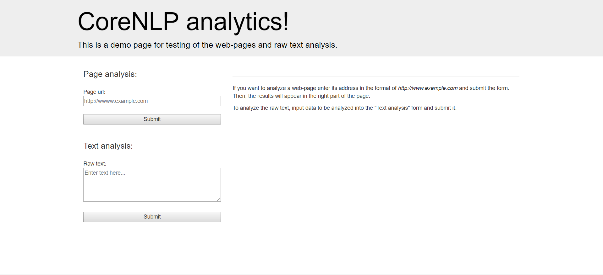

# Stanford CoreNLP web-page analysis tool

## Requirements

To build and run this application you`ll need to have following tools:
- Java 1.7+
- Docker
- Maven

## Build process

Firstly, you`ll need to build an app with basic maven command 
```mvn clean install```. Then, move resulted .jar file to the directory with a Docker file run.docker from this repository and build a  docker image with command ```sudo docker build -f run.docker -t corenlp/production:1 .``` , where corenlp/production:1 may be any image name you prefer. After that you can run an image with ``` sudo docker run -p 8080:8080 -p 80:8080 corenlp/production:1 ```. Also, this command will map 8080 and 80 ports to the app.

To verify, that you`ve run application successfully, you can use a GET request to the following address: ```http://yourhost.example/echo```. It should return current date/time data if everything worked well.

## Web usage

The simplest way to use the application is to use its web-demo. To open it, go to the '/' address of your host with the analyzer. You`ll see a main page of an app, like on the image below.



On this page, you can enter either a link to a page to be analyzed, either a text. If you`ll enter a text, then it will be analyzed on following aspects:
- Sentiment (from 1 to 5)
- Coreference chains
- LDA topic extraction (basically, 5 topics, 5 top words each)
- Named entities recognition (in web version just Person, Place, Organization and MISC, more via API)
- Short summary (up to 10 percents of text size)
- Keywords
- Basic statistics (number of words, sentences, words per sentence).

Also, application will build and return a parse tree of the text.

In case if user enters a link in the format of ```http://somesite.example/sompepage``` services will analyze such blocks of the page:
- Title
- Meta data
- Body text
- All previous together

However, it will do **topic extraction and summarization just for body** block.

## API reference

Another way to use the application is via API. It provides endpoints both for web-page analysis and single text processing.

### Raw text full analysis
#### ```POST /raw_analyze```

To get analysis of raw text, you can use the above endpoint. The request, should be in the following format:

```
POST /raw_analyze HTTP/1.1
Host: yourhost
Content-Type: application/json
{
"text": ["Text 1.", "Text 2"]
}
```

As you can see, it takes an array of input texts and return an array of analysis results.

### Summarization
#### ```POST /single_analyze/summary```

You can also get just a summary and a list of keywords for given texts. To do it, you should call the ```/single_analysis/summary``` endpoint with the following format of request:
```json
POST /single_analyze/summary HTTP/1.1
Host: 127.0.0.1:8080
Content-Type: application/json

{
"text": ["This summary script works well for news articles and blog posts and that’s the basic motive of implementing this script.", "Some another text to be analyzed"]
}
```

### Topic extration
#### ```POST /single_analyze/topics```

Finally, you can get topics data of given texts or text. To do such analysis, you should use request, like the following one:
```json
POST /single_analyze/topics HTTP/1.1
Host: 127.0.0.1:8080
Content-Type: application/json
{
"text": ["This summary script works well for news articles and blog posts and that’s the basic motive of implementing this script. It inputs the text content, splits it into paragraphs, splits it into sentences, filter out stopwords, calculates score (relevance) of each sentence, and on the basis of the scores assigned to each sentence it displays the most relevant results depending upon how concise we want our summary to be."]
}
```

### Web-page analysis
#### GET /url_analyze?target_url=http://somthing.example/

To analyze a page, user should send a GET-request to the /url_analyze endpoint as in the example above. As a result, server will return a PageAnalysisResult object, like the following one:

```json
{
    "titleAnalysisResult": {
        "targetText": "Obi Kaufmann's 'California Field Atlas' paints a breathtaking roadmap to California's wild places",
        "bodyEmotionsCoefficient": 4,
        "parseTree": "null(ROOT (NP (NP (NP (NP (NNP Obi) (NNP Kaufmann) (POS 's)) (`` `) (NNP California) (NNP Field)) (NP (NP (NNP Atlas) (POS ')) (NNS paints))) (NP (NP (DT a) (JJ breathtaking) (NN roadmap)) (PP (TO to) (NP (NP (NNP California) (POS 's)) (JJ wild) (NNS places))))))",
        "wordCount": 17,
        "sentenceCount": 1,
        "wordsPerSentence": 17,
        "corefChainsList": [
            [
                [
                    "1",
                    "California"
                ],
                [
                    "1",
                    "California 's"
                ]
            ]
        ],
        "topicExtractionResult": null,
        "summaryText": null,
        "keywordsString": null,
        "nerentities": {
            "LOCATION": [
                "California"
            ],
            "ORGANIZATION": [],
            "PERSON": [
                "Obi Kaufmann"
            ],
            "MISC": []
        }
    },
    "metaAnalysisResult": {
        "targetText": "obi kaufmann, california field atlas, obikaufmann, heyday books, coyote and thunder, premium arts.\nObi Kaufmann's 'California Field Atlas' paints a breathtaking roadmap to California's wild places.\nNaturalist, artist, activist, adventurer and now published author, Obi Kaufmann melds paintbrush and compass in the richly illustrated California Field Atlas to reveal the beautiful landscapes and ecosystems of our fair state.Kaufmann set out to uncover the secrets of the Golden State and provide us....\nObi Kaufmann's 'California Field Atlas' paints a breathtaking roadmap to California's wild places.\nNaturalist, artist, activist, adventurer and now published author, Obi Kaufmann melds paintbrush and compass in the richly illustrated California Field Atlas to reveal the beautiful landscapes and ecosystems of our fair state..\nNaturalist, artist, activist, adventurer and now published author, Obi Kaufmann melds paintbrush and compass in the richly illustrated California Field Atlas to reveal the beautiful landscapes and ecosystems of our fair state.Kaufmann set out to uncover the secrets of the Golden State and provide us....\n",
        "bodyEmotionsCoefficient": 3.2857142857142856,
        "parseTree": "null(ROOT (NP (NP (NN obi) (NN kaufmann)) (, ,) (NP (NP (NN california) (NN field) (NNS atlas)) (, ,) (NP (NN obikaufmann)) (, ,) (NP (NN heyday) (NNS books)) (, ,) (NP (NN coyote) (CC and) (NN thunder)) (, ,) (NP (NN premium) (NNS arts))) (. .)))(ROOT (NP (NP (NP (NNP Obi) (NNP Kaufmann) (POS 's)) (`` `) (NNP California) (NNP Field)) (NP (NP (NP (NNP Atlas) (POS ')) (NNS paints)) (NP (NP (DT a) (JJ breathtaking) (NN roadmap)) (PP (TO to) (NP (NP (NNP California) (POS 's)) (JJ wild) (NNS places))))) (. .)))(ROOT (S (S (NP (NP (NN Naturalist)) (, ,) (NP (NN artist)) (, ,) (NP (NN activist)) (, ,) (NP (NN adventurer)) (CC and) (NP (RB now))) (VP (VBN published) (NP (NN author)))) (, ,) (NP (NNP Obi) (NNP Kaufmann)) (VP (VBZ melds) (S (NP (NP (NN paintbrush) (CC and) (NN compass)) (PP (IN in) (NP (DT the) (ADJP (ADVP (RB richly)) (JJ illustrated)) (NNP California) (NNP Field) (NNP Atlas)))) (VP (TO to) (VP (VB reveal) (NP (NP (DT the) (JJ beautiful) (NNS landscapes) (CC and) (NNS ecosystems)) (PP (IN of) (NP (NP (PRP$ our) (JJ fair) (NN state.Kaufmann)) (VP (VBN set) (PRT (RP out)) (S (VP (TO to) (VP (VP (VB uncover) (NP (NP (DT the) (NNS secrets)) (PP (IN of) (NP (DT the) (NNP Golden) (NNP State))))) (CC and) (VP (VB provide) (NP (PRP us)))))))))))))) (: ...) (. .)))(ROOT (NP (NP (NP (NNP Obi) (NNP Kaufmann) (POS 's)) (`` `) (NNP California) (NNP Field)) (NP (NP (NP (NNP Atlas) (POS ')) (NNS paints)) (NP (NP (DT a) (JJ breathtaking) (NN roadmap)) (PP (TO to) (NP (NP (NNP California) (POS 's)) (JJ wild) (NNS places))))) (. .)))(ROOT (S (S (NP (NP (NN Naturalist)) (, ,) (NP (NN artist)) (, ,) (NP (NN activist)) (, ,) (NP (NN adventurer)) (CC and) (NP (RB now))) (VP (VBN published) (NP (NN author)))) (, ,) (NP (NNP Obi) (NNP Kaufmann)) (VP (VBZ melds) (S (NP (NP (NN paintbrush) (CC and) (NN compass)) (PP (IN in) (NP (DT the) (ADJP (ADVP (RB richly)) (JJ illustrated)) (NNP California) (NNP Field) (NNP Atlas)))) (VP (TO to) (VP (VB reveal) (NP (NP (DT the) (JJ beautiful) (NNS landscapes) (CC and) (NNS ecosystems)) (PP (IN of) (NP (PRP$ our) (JJ fair) (NN state)))))))) (. .)))(ROOT (NP (. .)))(ROOT (S (S (NP (NP (NN Naturalist)) (, ,) (NP (NN artist)) (, ,) (NP (NN activist)) (, ,) (NP (NN adventurer)) (CC and) (NP (RB now))) (VP (VBN published) (NP (NN author)))) (, ,) (NP (NNP Obi) (NNP Kaufmann)) (VP (VBZ melds) (S (NP (NP (NN paintbrush) (CC and) (NN compass)) (PP (IN in) (NP (DT the) (ADJP (ADVP (RB richly)) (JJ illustrated)) (NNP California) (NNP Field) (NNP Atlas)))) (VP (TO to) (VP (VB reveal) (NP (NP (DT the) (JJ beautiful) (NNS landscapes) (CC and) (NNS ecosystems)) (PP (IN of) (NP (NP (PRP$ our) (JJ fair) (NN state.Kaufmann)) (VP (VBN set) (PRT (RP out)) (S (VP (TO to) (VP (VP (VB uncover) (NP (NP (DT the) (NNS secrets)) (PP (IN of) (NP (DT the) (NNP Golden) (NNP State))))) (CC and) (VP (VB provide) (NP (PRP us)))))))))))))) (: ...)))",
        "wordCount": 194,
        "sentenceCount": 7,
        "wordsPerSentence": 27.714285,
        "corefChainsList": [
            [
                [
                    "1",
                    "california"
                ],
                [
                    "2",
                    "California"
                ],
                [
                    "2",
                    "California 's"
                ],
                [
                    "3",
                    "the richly illustrated California Field Atlas"
                ],
                [
                    "4",
                    "California"
                ],
                [
                    "4",
                    "California 's"
                ],
                [
                    "5",
                    "the richly illustrated California Field Atlas"
                ],
                [
                    "7",
                    "the richly illustrated California Field Atlas"
                ]
            ],
            [
                [
                    "2",
                    "Obi Kaufmann 's"
                ],
                [
                    "3",
                    "Obi Kaufmann"
                ],
                [
                    "4",
                    "Obi Kaufmann 's"
                ],
                [
                    "5",
                    "Obi Kaufmann"
                ],
                [
                    "7",
                    "Obi Kaufmann"
                ]
            ],
            [
                [
                    "3",
                    "the beautiful landscapes"
                ],
                [
                    "5",
                    "the beautiful landscapes"
                ],
                [
                    "7",
                    "the beautiful landscapes"
                ]
            ],
            [
                [
                    "3",
                    "our"
                ],
                [
                    "3",
                    "us"
                ],
                [
                    "5",
                    "our"
                ]
            ],
            [
                [
                    "3",
                    "the Golden State"
                ],
                [
                    "5",
                    "our fair state"
                ],
                [
                    "7",
                    "the Golden State"
                ]
            ],
            [
                [
                    "3",
                    "Naturalist , artist , activist , adventurer and now"
                ],
                [
                    "5",
                    "Naturalist , artist , activist , adventurer and now"
                ],
                [
                    "7",
                    "Naturalist , artist , activist , adventurer and now"
                ]
            ],
            [
                [
                    "2",
                    "Atlas ' paints"
                ],
                [
                    "4",
                    "Atlas ' paints"
                ]
            ],
            [
                [
                    "3",
                    "our fair state.Kaufmann set out to uncover the secrets of the Golden State and provide us"
                ],
                [
                    "7",
                    "our fair state.Kaufmann set out to uncover the secrets of the Golden State and provide us"
                ]
            ],
            [
                [
                    "3",
                    "the secrets of the Golden State"
                ],
                [
                    "7",
                    "the secrets of the Golden State"
                ]
            ],
            [
                [
                    "2",
                    "Atlas '"
                ],
                [
                    "4",
                    "Atlas '"
                ]
            ],
            [
                [
                    "3",
                    "artist"
                ],
                [
                    "5",
                    "artist"
                ]
            ],
            [
                [
                    "3",
                    "activist"
                ],
                [
                    "5",
                    "activist"
                ]
            ],
            [
                [
                    "3",
                    "adventurer"
                ],
                [
                    "5",
                    "adventurer"
                ]
            ]
        ],
        "topicExtractionResult": null,
        "summaryText": null,
        "keywordsString": null,
        "nerentities": {
            "LOCATION": [
                "california",
                "California",
                "Field Atlas",
                "Golden State"
            ],
            "ORGANIZATION": [],
            "DATE": [
                "now"
            ],
            "PERSON": [
                "Obi Kaufmann"
            ],
            "MISC": []
        }
    },
    "bodyAnalysisResult": {
        "targetText": "Kaufmann set out to uncover the secrets of the Golden State and provide us an artist's and poet's rendering of his best finds. A Bay Area native, he has been imparting his naturalist eye to drawings and painting ever since he was a little boy growing up on Mt. Diablo. \"I would map the trails in the sage mazes and I would draw the animals obsessively, all the while feeling a real kinship to them.\"\nThis 600-page volume features 250 hand-painted maps and 600 other works of art that Kaufmann has amassed during his lifetime of connecting with nature.\n\"It is such a massive project that I know that from here on out my life will be forever defined by it. There will be everything before the California Field Atlas and then there will be everything after.\"\nThe paintings find a real truth not only in the land, but in the animals he interacts with. Accurate presentations of wildlife, to him, are as integral to understanding the California landscape as his geographical representations. \"Artistically, there's almost a topographic relevance to the well-rendered animal—it's still a kind of mapped beauty.\"\nKaufmann is clear that this isn't the book to turn to when lost in the woods or trying to figure out how to rough it in Yosemite, but encourages you to dive deep into its pages if you're looking for a \"handbook for conservation\" or \"an indispensable companion for the classic California road trip.\"\nAnd while the paintings and maps are meaningful to anyone who identifies as a Californian, they belie the reality of the state of the wilderness: \"The natural world in California is in need of some major love and caring from humans,\" says Kaufmann.\n\"Every natural system in California is living and deserves respect. This whole book—this whole endeavor—is an exercise in how we can continue our human residency in California not only over the next 100 years, for example, but over the next 10,000 years,\" he says. \"California will keep taking care of us if we take care of it.\"\nWhat became quickly apparent is the artist's absolute and unwavering belief that there is hope for nature in California. The last chapter of his book, \"The Rewilded Future,\" presents an alternate view for reconnecting the wilderness, reintroducing lost species and expanding our landscape.\n\"Give me my dying days in the High Sierra and it will be happy death,\" says Kaufmann, who can be found working at his storefront studio, Premium Arts (at 4130 Broadway) in Oakland. California Field Atlas ($45) is now available for preorders at heydaybooks.com.\nBeautiful illustrations from Obi Kaufmann's new book The California Field Atlas\n",
        "bodyEmotionsCoefficient": 3.1578947368421053,
        "parseTree": "null(ROOT (S (NP (NNP Kaufmann)) (VP (VBD set) (PRT (RP out)) (S (VP (TO to) (VP (VP (VB uncover) (NP (NP (DT the) (NNS secrets)) (PP (IN of) (NP (DT the) (NNP Golden) (NNP State))))) (CC and) (VP (VB provide) (NP (PRP us)) (NP (NP (NP (DT an) (NN artist) (POS 's)) (CC and) (NP (NN poet) (POS 's))) (SBAR (S (NP (NP (NN rendering)) (PP (IN of) (NP (PRP$ his) (JJS best)))) (VP (VBZ finds)))))))))) (. .)))(ROOT (S (NP-TMP (NP (DT A) (NNP Bay) (NNP Area)) (NP (JJ native))) (, ,) (NP (PRP he)) (VP (VBZ has) (VP (VBN been) (VP (VBG imparting) (NP (PRP$ his) (NN naturalist) (NN eye)) (PP (TO to) (NP (NNS drawings) (CC and) (NN painting))) (SBAR (RB ever) (IN since) (S (NP (PRP he)) (VP (VBD was) (NP (NP (DT a) (JJ little) (NN boy)) (VP (VBG growing) (PRT (RP up)) (PP (IN on) (NP (NNP Mt.) (NNP Diablo))))))))))) (. .)))(ROOT (S (`` ``) (NP (PRP I)) (VP (MD would) (VP (VB map) (S (S (NP (DT the)) (VP (VBZ trails) (PP (IN in) (NP (DT the) (NN sage) (NNS mazes))))) (CC and) (S (NP (PRP I)) (VP (MD would) (VP (VB draw) (NP (DT the) (NNS animals)) (ADVP (RB obsessively))))) (, ,) (S (NP (PDT all) (DT the) (NN while)) (VP (VBG feeling) (NP (DT a) (JJ real) (NN kinship)) (PP (TO to) (NP (PRP them)))))))) (. .) ('' '')))(ROOT (NP (NP (NP (NP (DT This) (JJ 600-page) (NN volume) (NNS features)) (NP (CD 250) (JJ hand-painted) (NNS maps))) (CC and) (NP (NP (CD 600) (JJ other) (NNS works)) (PP (IN of) (NP (NN art))) (SBAR (WHNP (WDT that)) (S (NP (NNP Kaufmann)) (VP (VBZ has) (VP (VBN amassed) (PP (IN during) (NP (PRP$ his) (NN lifetime))))))))) (PP (IN of) (S (VP (VBG connecting) (PP (IN with) (NP (NN nature)))))) (. .)))(ROOT (S (`` ``) (NP (PRP It)) (VP (VBZ is) (PP (JJ such) (NP (DT a) (JJ massive) (NN project))) (SBAR (IN that) (S (NP (PRP I)) (VP (VBP know) (SBAR (IN that) (X (X (IN from)) (PP (ADVP (RB here)) (IN on) (IN out) (NP (NP (PRP$ my) (NN life)) (SBAR (S (VP (MD will) (VP (VB be) (VP (ADVP (RB forever)) (VBN defined) (PP (IN by) (NP (PRP it)))))))))))))))) (. .)))(ROOT (S (S (NP (EX There)) (VP (MD will) (VP (VB be) (NP (NP (NN everything)) (PP (IN before) (NP (DT the) (NNP California) (NNP Field) (NNP Atlas))))))) (CC and) (RB then) (S (NP (EX there)) (VP (MD will) (VP (VB be) (NP (NN everything)) (PP (IN after))))) (. .) ('' '')))(ROOT (S (S (NP (DT The) (NNS paintings)) (VP (VBP find) (NP (DT a) (JJ real) (NN truth)) (PP (CONJP (RB not) (RB only)) (PP (IN in) (NP (DT the) (NN land))) (, ,) (CC but) (PP (IN in) (NP (DT the) (NNS animals)))))) (NP (PRP he)) (VP (VBZ interacts) (PP (IN with))) (. .)))(ROOT (S (NP (NP (JJ Accurate) (NNS presentations)) (PP (IN of) (NP (NN wildlife))) (, ,) (PP (TO to) (NP (PRP him))) (, ,)) (VP (VBP are) (PP (IN as) (NP (NP (JJ integral)) (PP (TO to) (S (VP (VBG understanding) (NP (DT the) (NNP California) (NN landscape)) (PP (IN as) (NP (PRP$ his) (JJ geographical) (NNS representations))))))))) (. .)))(ROOT (S (`` ``) (ADVP (RB Artistically)) (, ,) (S (NP (EX there)) (VP (VBZ 's) (NP (NP (RB almost) (DT a) (JJ topographic) (NN relevance)) (PP (TO to) (NP (DT the) (JJ well-rendered) (NN animal)))))) (: --) (S (NP (PRP it)) (VP (VBZ 's) (ADVP (RB still)) (NP (NP (DT a) (NN kind)) (PP (IN of) (S (VP (VBN mapped) (NP (NN beauty)))))))) (. .) ('' '')))(ROOT (S (NP (NNP Kaufmann)) (VP (VBZ is) (ADJP (JJ clear) (SBAR (IN that) (S (NP (DT this)) (VP (VBZ is) (RB n't) (NP (DT the) (NN book) (S (VP (TO to) (VP (VP (VB turn) (PP (TO to) (SBAR (WHADVP (WRB when)) (S (VP (VP (VBN lost) (PP (IN in) (NP (DT the) (NNS woods)))) (CC or) (VP (VBG trying) (S (VP (TO to) (VP (VB figure) (PRT (RP out)))))))))) (SBAR (WHADVP (WRB how)) (S (VP (TO to) (VP (ADJP (JJ rough) (NP (PRP it))) (PP (IN in) (NP (NNP Yosemite)))))))) (, ,) (CC but) (VP (VBZ encourages) (NP (PRP you)) (PP (TO to) (NP (NN dive))) (ADVP (RB deep) (PP (IN into) (NP (PRP$ its) (NNS pages))))))))))))) (SBAR (IN if) (S (NP (PRP you)) (VP (VBP 're) (VP (VBG looking) (PP (IN for) (NP (NP (NP (DT a) (`` ``) (NN handbook)) (PP (IN for) (NP (NN conservation)))) ('' '') (CC or) (`` ``) (NP (NP (DT an) (JJ indispensable) (NN companion)) (PP (IN for) (NP (DT the) (JJ classic) (NNP California) (NN road) (NN trip))))))))))) (. .) ('' '')))(ROOT (SINV (S (CC And) (SBAR (IN while) (S (NP (DT the) (NNS paintings) (CC and) (NNS maps)) (VP (VBP are) (ADJP (JJ meaningful) (PP (TO to) (NP (NP (NN anyone)) (SBAR (WHNP (WP who)) (S (VP (VBZ identifies) (PP (IN as) (NP (DT a) (NN Californian)))))))))))) (, ,) (NP (PRP they)) (VP (VBP belie) (NP (NP (NP (DT the) (NN reality)) (PP (IN of) (NP (NP (DT the) (NN state)) (PP (IN of) (NP (DT the) (NN wilderness)))))) (: :) (S (`` ``) (NP (NP (DT The) (JJ natural) (NN world)) (PP (IN in) (NP (NNP California)))) (VP (VBZ is) (PP (IN in) (NP (NP (NN need)) (PP (IN of) (NP (NP (DT some) (JJ major) (NN love) (CC and) (NN caring)) (PP (IN from) (NP (NNS humans)))))))))))) (, ,) ('' '') (VP (VBZ says)) (NP (NNP Kaufmann)) (. .)))(ROOT (S (`` ``) (NP (NP (DT Every) (JJ natural) (NN system)) (PP (IN in) (NP (NNP California)))) (VP (VP (VBZ is) (VP (VBG living))) (CC and) (VP (VBZ deserves) (NP (NN respect)))) (. .)))(ROOT (S (S (NP (NP (DT This) (JJ whole) (NN book)) (PRN (: --) (NP (DT this) (JJ whole) (NN endeavor)) (: --))) (VP (VBZ is) (NP (NP (DT an) (NN exercise)) (PP (IN in) (SBAR (WHADVP (WRB how)) (S (NP (PRP we)) (VP (MD can) (VP (VB continue) (NP (PRP$ our) (JJ human) (NN residency)) (PP (IN in) (NP (NNP California))) (PP (CONJP (RB not) (RB only)) (PP (IN over) (NP (NP (DT the) (JJ next) (CD 100) (NNS years)) (, ,) (PP (IN for) (NP (NN example))))) (, ,) (CC but) (PP (IN over) (NP (DT the) (JJ next) (CD 10,000) (NNS years)))))))))))) (, ,) ('' '') (NP (PRP he)) (VP (VBZ says)) (. .)))(ROOT (S (`` ``) (NP (NNP California)) (VP (MD will) (VP (VB keep) (S (VP (VBG taking) (NP (NP (NN care)) (PP (IN of) (NP (PRP us)))))) (SBAR (IN if) (S (NP (PRP we)) (VP (VBP take) (NP (NP (NN care)) (PP (IN of) (NP (PRP it))))))))) (. .) ('' '')))(ROOT (S (SBAR (WHNP (WDT What)) (S (VP (VBD became) (ADVP (RB quickly)) (ADJP (JJ apparent))))) (VP (VBZ is) (NP (NP (NP (DT the) (NN artist) (POS 's)) (JJ absolute) (CC and) (JJ unwavering) (NN belief)) (SBAR (IN that) (S (NP (EX there)) (VP (VBZ is) (NP (NP (NN hope)) (PP (IN for) (NP (NP (NN nature)) (PP (IN in) (NP (NNP California))))))))))) (. .)))(ROOT (S (NP (NP (NP (DT The) (JJ last) (NN chapter)) (PP (IN of) (NP (PRP$ his) (NN book)))) (, ,) (`` ``) (NP (DT The) (NNP Rewilded) (NNP Future)) (, ,) ('' '')) (VP (VBZ presents) (NP (DT an) (JJ alternate) (NN view)) (PP (IN for) (S (VP (VP (VBG reconnecting) (NP (DT the) (NN wilderness))) (, ,) (VP (VBG reintroducing) (NP (VBN lost) (NNS species))) (CC and) (VP (VBG expanding) (NP (PRP$ our) (NN landscape))))))) (. .)))(ROOT (SINV (`` ``) (S (S (VP (VB Give) (NP (PRP me)) (NP (NP (PRP$ my) (VBG dying) (NNS days)) (PP (IN in) (NP (DT the) (JJ High) (NNP Sierra)))))) (CC and) (S (NP (PRP it)) (VP (MD will) (VP (VB be) (NP (JJ happy) (NN death)))))) (, ,) ('' '') (VP (VBZ says) (NP (NP (NNP Kaufmann)) (, ,) (SBAR (WHNP (WP who)) (S (VP (MD can) (VP (VB be) (VP (VBN found) (S (VP (VBG working) (PP (IN at) (NP (PRP$ his) (NN storefront)))))))))))) (NP (NP (NN studio)) (, ,) (NP (NP (NP (NNP Premium) (NNS Arts)) (PRN (-LRB- -LRB-) (NP (ADVP (IN at) (NP (CD 4130))) (NNP Broadway)) (-RRB- -RRB-))) (PP (IN in) (NP (NNP Oakland))))) (. .)))(ROOT (S (NP (NP (NNP California) (NNP Field) (NNP Atlas)) (PRN (-LRB- -LRB-) (NP ($ $) (CD 45)) (-RRB- -RRB-))) (VP (VBZ is) (ADVP (RB now)) (ADJP (JJ available) (PP (IN for) (NP (NP (NNS preorders)) (PP (IN at) (NP (NNP heydaybooks.com))))))) (. .)))(ROOT (NP (NP (NP (JJ Beautiful) (NNS illustrations)) (PP (IN from) (NP (NP (NNP Obi) (NNP Kaufmann) (POS 's)) (JJ new) (NN book)))) (NP (DT The) (NNP California) (NNP Field) (NNP Atlas))))",
        "wordCount": 517,
        "sentenceCount": 19,
        "wordsPerSentence": 27.210526,
        "corefChainsList": [
            [
                [
                    "1",
                    "Kaufmann"
                ],
                [
                    "1",
                    "his"
                ],
                [
                    "2",
                    "he"
                ],
                [
                    "2",
                    "his"
                ],
                [
                    "2",
                    "he"
                ],
                [
                    "3",
                    "I"
                ],
                [
                    "3",
                    "I"
                ],
                [
                    "4",
                    "Kaufmann"
                ],
                [
                    "4",
                    "his"
                ],
                [
                    "7",
                    "he"
                ],
                [
                    "8",
                    "him"
                ],
                [
                    "8",
                    "his"
                ],
                [
                    "10",
                    "Kaufmann"
                ],
                [
                    "11",
                    "Kaufmann"
                ],
                [
                    "17",
                    "Kaufmann , who can be found working at his storefront"
                ],
                [
                    "19",
                    "Obi Kaufmann 's"
                ]
            ],
            [
                [
                    "8",
                    "California"
                ],
                [
                    "10",
                    "California"
                ],
                [
                    "11",
                    "California"
                ],
                [
                    "12",
                    "California"
                ],
                [
                    "13",
                    "California"
                ],
                [
                    "14",
                    "California"
                ],
                [
                    "14",
                    "it"
                ],
                [
                    "15",
                    "California"
                ],
                [
                    "18",
                    "California"
                ],
                [
                    "19",
                    "California"
                ]
            ],
            [
                [
                    "13",
                    "we"
                ],
                [
                    "13",
                    "our"
                ],
                [
                    "14",
                    "us"
                ],
                [
                    "14",
                    "we"
                ],
                [
                    "16",
                    "our"
                ]
            ],
            [
                [
                    "16",
                    "his"
                ],
                [
                    "17",
                    "me"
                ],
                [
                    "17",
                    "my"
                ],
                [
                    "17",
                    "his"
                ]
            ],
            [
                [
                    "10",
                    "this"
                ],
                [
                    "10",
                    "it"
                ],
                [
                    "10",
                    "its"
                ]
            ],
            [
                [
                    "13",
                    "This whole book"
                ],
                [
                    "16",
                    "his book"
                ],
                [
                    "19",
                    "Obi Kaufmann 's new book"
                ]
            ],
            [
                [
                    "3",
                    "the animals"
                ],
                [
                    "3",
                    "them"
                ],
                [
                    "7",
                    "the animals"
                ]
            ],
            [
                [
                    "13",
                    "the next 100 years"
                ],
                [
                    "13",
                    "the next 10,000 years"
                ]
            ],
            [
                [
                    "5",
                    "I"
                ],
                [
                    "5",
                    "my"
                ]
            ],
            [
                [
                    "5",
                    "It"
                ],
                [
                    "5",
                    "it"
                ]
            ],
            [
                [
                    "17",
                    "the High Sierra"
                ],
                [
                    "17",
                    "it"
                ]
            ],
            [
                [
                    "10",
                    "you"
                ],
                [
                    "10",
                    "you"
                ]
            ],
            [
                [
                    "11",
                    "the paintings and maps"
                ],
                [
                    "11",
                    "they"
                ]
            ],
            [
                [
                    "1",
                    "an artist 's"
                ],
                [
                    "15",
                    "the artist 's"
                ]
            ],
            [
                [
                    "1",
                    "the Golden State"
                ],
                [
                    "11",
                    "the state of the wilderness"
                ]
            ],
            [
                [
                    "6",
                    "the California Field Atlas"
                ],
                [
                    "19",
                    "The California Field Atlas"
                ]
            ],
            [
                [
                    "11",
                    "the wilderness"
                ],
                [
                    "16",
                    "the wilderness"
                ]
            ],
            [
                [
                    "9",
                    "almost a topographic relevance to the well-rendered animal"
                ],
                [
                    "9",
                    "it"
                ]
            ]
        ],
        "topicExtractionResult": {
            "numTopics": 5,
            "numWords": 5,
            "data": [
                [
                    {
                        "word": "years",
                        "weight": 2
                    },
                    {
                        "word": "nature",
                        "weight": 2
                    },
                    {
                        "word": "artist's",
                        "weight": 2
                    },
                    {
                        "word": "studio",
                        "weight": 1
                    },
                    {
                        "word": "high",
                        "weight": 1
                    }
                ],
                [
                    {
                        "word": "california",
                        "weight": 10
                    },
                    {
                        "word": "natural",
                        "weight": 2
                    },
                    {
                        "word": "wilderness",
                        "weight": 2
                    },
                    {
                        "word": "lost",
                        "weight": 2
                    },
                    {
                        "word": "illustrations",
                        "weight": 1
                    }
                ],
                [
                    {
                        "word": "kaufmann",
                        "weight": 5
                    },
                    {
                        "word": "book",
                        "weight": 3
                    },
                    {
                        "word": "paintings",
                        "weight": 2
                    },
                    {
                        "word": "kaufmann's",
                        "weight": 1
                    },
                    {
                        "word": "obi",
                        "weight": 1
                    }
                ],
                [
                    {
                        "word": "atlas",
                        "weight": 3
                    },
                    {
                        "word": "landscape",
                        "weight": 2
                    },
                    {
                        "word": "maps",
                        "weight": 2
                    },
                    {
                        "word": "real",
                        "weight": 2
                    },
                    {
                        "word": "oakland",
                        "weight": 1
                    }
                ],
                [
                    {
                        "word": "field",
                        "weight": 3
                    },
                    {
                        "word": "care",
                        "weight": 2
                    },
                    {
                        "word": "animals",
                        "weight": 2
                    },
                    {
                        "word": "state",
                        "weight": 2
                    },
                    {
                        "word": "preorders",
                        "weight": 1
                    }
                ]
            ]
        },
        "summaryText": "Kaufmann set out to uncover the secrets of the Golden State and provide us an artist's and poet's rendering of his best finds. ",
        "keywordsString": "uncover, state, set, secrets, rendering, provide, poet, kaufmann, golden, finds, artist",
        "nerentities": {
            "LOCATION": [
                "Golden State",
                "Bay Area",
                "Mt. Diablo",
                "California Field Atlas",
                "California",
                "Yosemite",
                "Broadway",
                "Oakland"
            ],
            "ORGANIZATION": [
                "Premium Arts"
            ],
            "DATE": [
                "Future",
                "now"
            ],
            "MONEY": [
                "$ 45"
            ],
            "NUMBER": [
                "250",
                "600",
                "4130"
            ],
            "PERSON": [
                "Kaufmann",
                "Obi"
            ],
            "MISC": [
                "Californian"
            ],
            "DURATION": [
                "the next 100 years",
                "the next 10,000 years",
                "days"
            ]
        }
    },
    "wholePageAnalysisResult": {
        "targetText": "Obi Kaufmann's 'California Field Atlas' paints a breathtaking roadmap to California's wild places\nobi kaufmann, california field atlas, obikaufmann, heyday books, coyote and thunder, premium arts.\nObi Kaufmann's 'California Field Atlas' paints a breathtaking roadmap to California's wild places.\nNaturalist, artist, activist, adventurer and now published author, Obi Kaufmann melds paintbrush and compass in the richly illustrated California Field Atlas to reveal the beautiful landscapes and ecosystems of our fair state.Kaufmann set out to uncover the secrets of the Golden State and provide us....\nObi Kaufmann's 'California Field Atlas' paints a breathtaking roadmap to California's wild places.\nNaturalist, artist, activist, adventurer and now published author, Obi Kaufmann melds paintbrush and compass in the richly illustrated California Field Atlas to reveal the beautiful landscapes and ecosystems of our fair state..\nNaturalist, artist, activist, adventurer and now published author, Obi Kaufmann melds paintbrush and compass in the richly illustrated California Field Atlas to reveal the beautiful landscapes and ecosystems of our fair state.Kaufmann set out to uncover the secrets of the Golden State and provide us....\n\nKaufmann set out to uncover the secrets of the Golden State and provide us an artist's and poet's rendering of his best finds. A Bay Area native, he has been imparting his naturalist eye to drawings and painting ever since he was a little boy growing up on Mt. Diablo. \"I would map the trails in the sage mazes and I would draw the animals obsessively, all the while feeling a real kinship to them.\"\nThis 600-page volume features 250 hand-painted maps and 600 other works of art that Kaufmann has amassed during his lifetime of connecting with nature.\n\"It is such a massive project that I know that from here on out my life will be forever defined by it. There will be everything before the California Field Atlas and then there will be everything after.\"\nThe paintings find a real truth not only in the land, but in the animals he interacts with. Accurate presentations of wildlife, to him, are as integral to understanding the California landscape as his geographical representations. \"Artistically, there's almost a topographic relevance to the well-rendered animal—it's still a kind of mapped beauty.\"\nKaufmann is clear that this isn't the book to turn to when lost in the woods or trying to figure out how to rough it in Yosemite, but encourages you to dive deep into its pages if you're looking for a \"handbook for conservation\" or \"an indispensable companion for the classic California road trip.\"\nAnd while the paintings and maps are meaningful to anyone who identifies as a Californian, they belie the reality of the state of the wilderness: \"The natural world in California is in need of some major love and caring from humans,\" says Kaufmann.\n\"Every natural system in California is living and deserves respect. This whole book—this whole endeavor—is an exercise in how we can continue our human residency in California not only over the next 100 years, for example, but over the next 10,000 years,\" he says. \"California will keep taking care of us if we take care of it.\"\nWhat became quickly apparent is the artist's absolute and unwavering belief that there is hope for nature in California. The last chapter of his book, \"The Rewilded Future,\" presents an alternate view for reconnecting the wilderness, reintroducing lost species and expanding our landscape.\n\"Give me my dying days in the High Sierra and it will be happy death,\" says Kaufmann, who can be found working at his storefront studio, Premium Arts (at 4130 Broadway) in Oakland. California Field Atlas ($45) is now available for preorders at heydaybooks.com.\nBeautiful illustrations from Obi Kaufmann's new book The California Field Atlas\n",
        "bodyEmotionsCoefficient": 3.230769230769231,
        "parseTree": "null(ROOT (NP (NP (NP (NNP Obi) (NNP Kaufmann) (POS 's)) (`` `) (NNP California) (NNP Field)) (NP (NP (NP (NNP Atlas) (POS ')) (NNS paints)) (SBAR (S (NP (NP (DT a) (JJ breathtaking) (NN roadmap)) (PP (TO to) (NP (NP (NNP California) (POS 's)) (JJ wild) (NNS places)))) (VP (VBP obi) (NP (NP (NN kaufmann)) (, ,) (NP (NN california) (NN field) (NNS atlas)) (, ,) (NP (NN obikaufmann)) (, ,) (NP (NN heyday) (NNS books)) (, ,) (NP (NN coyote) (CC and) (NN thunder)) (, ,) (NP (NN premium) (NNS arts))))))) (. .)))(ROOT (NP (NP (NP (NNP Obi) (NNP Kaufmann) (POS 's)) (`` `) (NNP California) (NNP Field)) (NP (NP (NP (NNP Atlas) (POS ')) (NNS paints)) (NP (NP (DT a) (JJ breathtaking) (NN roadmap)) (PP (TO to) (NP (NP (NNP California) (POS 's)) (JJ wild) (NNS places))))) (. .)))(ROOT (S (S (NP (NP (NN Naturalist)) (, ,) (NP (NN artist)) (, ,) (NP (NN activist)) (, ,) (NP (NN adventurer)) (CC and) (NP (RB now))) (VP (VBN published) (NP (NN author)))) (, ,) (NP (NNP Obi) (NNP Kaufmann)) (VP (VBZ melds) (S (NP (NP (NN paintbrush) (CC and) (NN compass)) (PP (IN in) (NP (DT the) (ADJP (ADVP (RB richly)) (JJ illustrated)) (NNP California) (NNP Field) (NNP Atlas)))) (VP (TO to) (VP (VB reveal) (NP (NP (DT the) (JJ beautiful) (NNS landscapes) (CC and) (NNS ecosystems)) (PP (IN of) (NP (NP (PRP$ our) (JJ fair) (NN state.Kaufmann)) (VP (VBN set) (PRT (RP out)) (S (VP (TO to) (VP (VP (VB uncover) (NP (NP (DT the) (NNS secrets)) (PP (IN of) (NP (DT the) (NNP Golden) (NNP State))))) (CC and) (VP (VB provide) (NP (PRP us)))))))))))))) (: ...) (. .)))(ROOT (NP (NP (NP (NNP Obi) (NNP Kaufmann) (POS 's)) (`` `) (NNP California) (NNP Field)) (NP (NP (NP (NNP Atlas) (POS ')) (NNS paints)) (NP (NP (DT a) (JJ breathtaking) (NN roadmap)) (PP (TO to) (NP (NP (NNP California) (POS 's)) (JJ wild) (NNS places))))) (. .)))(ROOT (S (S (NP (NP (NN Naturalist)) (, ,) (NP (NN artist)) (, ,) (NP (NN activist)) (, ,) (NP (NN adventurer)) (CC and) (NP (RB now))) (VP (VBN published) (NP (NN author)))) (, ,) (NP (NNP Obi) (NNP Kaufmann)) (VP (VBZ melds) (S (NP (NP (NN paintbrush) (CC and) (NN compass)) (PP (IN in) (NP (DT the) (ADJP (ADVP (RB richly)) (JJ illustrated)) (NNP California) (NNP Field) (NNP Atlas)))) (VP (TO to) (VP (VB reveal) (NP (NP (DT the) (JJ beautiful) (NNS landscapes) (CC and) (NNS ecosystems)) (PP (IN of) (NP (PRP$ our) (JJ fair) (NN state)))))))) (. .)))(ROOT (NP (. .)))(ROOT (S (S (NP (NP (NN Naturalist)) (, ,) (NP (NN artist)) (, ,) (NP (NN activist)) (, ,) (NP (NN adventurer)) (CC and) (NP (RB now))) (VP (VBN published) (NP (NN author)))) (, ,) (NP (NNP Obi) (NNP Kaufmann)) (VP (VBZ melds) (S (NP (NP (NN paintbrush) (CC and) (NN compass)) (PP (IN in) (NP (DT the) (ADJP (ADVP (RB richly)) (JJ illustrated)) (NNP California) (NNP Field) (NNP Atlas)))) (VP (TO to) (VP (VB reveal) (NP (NP (DT the) (JJ beautiful) (NNS landscapes) (CC and) (NNS ecosystems)) (PP (IN of) (NP (NP (PRP$ our) (JJ fair) (NN state.Kaufmann)) (VP (VBN set) (PRT (RP out)) (S (VP (TO to) (VP (VP (VB uncover) (NP (NP (DT the) (NNS secrets)) (PP (IN of) (NP (DT the) (NNP Golden) (NNP State))))) (CC and) (VP (VB provide) (NP (PRP us)))))))))))))) (: ...) (. .)))(ROOT (S (NP (NNP Kaufmann)) (VP (VBD set) (PRT (RP out)) (S (VP (TO to) (VP (VP (VB uncover) (NP (NP (DT the) (NNS secrets)) (PP (IN of) (NP (DT the) (NNP Golden) (NNP State))))) (CC and) (VP (VB provide) (NP (PRP us)) (NP (NP (NP (DT an) (NN artist) (POS 's)) (CC and) (NP (NN poet) (POS 's))) (SBAR (S (NP (NP (NN rendering)) (PP (IN of) (NP (PRP$ his) (JJS best)))) (VP (VBZ finds)))))))))) (. .)))(ROOT (S (NP-TMP (NP (DT A) (NNP Bay) (NNP Area)) (NP (JJ native))) (, ,) (NP (PRP he)) (VP (VBZ has) (VP (VBN been) (VP (VBG imparting) (NP (PRP$ his) (NN naturalist) (NN eye)) (PP (TO to) (NP (NNS drawings) (CC and) (NN painting))) (SBAR (RB ever) (IN since) (S (NP (PRP he)) (VP (VBD was) (NP (NP (DT a) (JJ little) (NN boy)) (VP (VBG growing) (PRT (RP up)) (PP (IN on) (NP (NNP Mt.) (NNP Diablo))))))))))) (. .)))(ROOT (S (`` ``) (NP (PRP I)) (VP (MD would) (VP (VB map) (S (S (NP (DT the)) (VP (VBZ trails) (PP (IN in) (NP (DT the) (NN sage) (NNS mazes))))) (CC and) (S (NP (PRP I)) (VP (MD would) (VP (VB draw) (NP (DT the) (NNS animals)) (ADVP (RB obsessively))))) (, ,) (S (NP (PDT all) (DT the) (NN while)) (VP (VBG feeling) (NP (DT a) (JJ real) (NN kinship)) (PP (TO to) (NP (PRP them)))))))) (. .) ('' '')))(ROOT (NP (NP (NP (NP (DT This) (JJ 600-page) (NN volume) (NNS features)) (NP (CD 250) (JJ hand-painted) (NNS maps))) (CC and) (NP (NP (CD 600) (JJ other) (NNS works)) (PP (IN of) (NP (NN art))) (SBAR (WHNP (WDT that)) (S (NP (NNP Kaufmann)) (VP (VBZ has) (VP (VBN amassed) (PP (IN during) (NP (PRP$ his) (NN lifetime))))))))) (PP (IN of) (S (VP (VBG connecting) (PP (IN with) (NP (NN nature)))))) (. .)))(ROOT (S (`` ``) (NP (PRP It)) (VP (VBZ is) (PP (JJ such) (NP (DT a) (JJ massive) (NN project))) (SBAR (IN that) (S (NP (PRP I)) (VP (VBP know) (SBAR (IN that) (X (X (IN from)) (PP (ADVP (RB here)) (IN on) (IN out) (NP (NP (PRP$ my) (NN life)) (SBAR (S (VP (MD will) (VP (VB be) (VP (ADVP (RB forever)) (VBN defined) (PP (IN by) (NP (PRP it)))))))))))))))) (. .)))(ROOT (S (S (NP (EX There)) (VP (MD will) (VP (VB be) (NP (NP (NN everything)) (PP (IN before) (NP (DT the) (NNP California) (NNP Field) (NNP Atlas))))))) (CC and) (RB then) (S (NP (EX there)) (VP (MD will) (VP (VB be) (NP (NN everything)) (PP (IN after))))) (. .) ('' '')))(ROOT (S (S (NP (DT The) (NNS paintings)) (VP (VBP find) (NP (DT a) (JJ real) (NN truth)) (PP (CONJP (RB not) (RB only)) (PP (IN in) (NP (DT the) (NN land))) (, ,) (CC but) (PP (IN in) (NP (DT the) (NNS animals)))))) (NP (PRP he)) (VP (VBZ interacts) (PP (IN with))) (. .)))(ROOT (S (NP (NP (JJ Accurate) (NNS presentations)) (PP (IN of) (NP (NN wildlife))) (, ,) (PP (TO to) (NP (PRP him))) (, ,)) (VP (VBP are) (PP (IN as) (NP (NP (JJ integral)) (PP (TO to) (S (VP (VBG understanding) (NP (DT the) (NNP California) (NN landscape)) (PP (IN as) (NP (PRP$ his) (JJ geographical) (NNS representations))))))))) (. .)))(ROOT (S (`` ``) (ADVP (RB Artistically)) (, ,) (S (NP (EX there)) (VP (VBZ 's) (NP (NP (RB almost) (DT a) (JJ topographic) (NN relevance)) (PP (TO to) (NP (DT the) (JJ well-rendered) (NN animal)))))) (: --) (S (NP (PRP it)) (VP (VBZ 's) (ADVP (RB still)) (NP (NP (DT a) (NN kind)) (PP (IN of) (S (VP (VBN mapped) (NP (NN beauty)))))))) (. .) ('' '')))(ROOT (S (NP (NNP Kaufmann)) (VP (VBZ is) (ADJP (JJ clear) (SBAR (IN that) (S (NP (DT this)) (VP (VBZ is) (RB n't) (NP (DT the) (NN book) (S (VP (TO to) (VP (VP (VB turn) (PP (TO to) (SBAR (WHADVP (WRB when)) (S (VP (VP (VBN lost) (PP (IN in) (NP (DT the) (NNS woods)))) (CC or) (VP (VBG trying) (S (VP (TO to) (VP (VB figure) (PRT (RP out)))))))))) (SBAR (WHADVP (WRB how)) (S (VP (TO to) (VP (ADJP (JJ rough) (NP (PRP it))) (PP (IN in) (NP (NNP Yosemite)))))))) (, ,) (CC but) (VP (VBZ encourages) (NP (PRP you)) (PP (TO to) (NP (NN dive))) (ADVP (RB deep) (PP (IN into) (NP (PRP$ its) (NNS pages))))))))))))) (SBAR (IN if) (S (NP (PRP you)) (VP (VBP 're) (VP (VBG looking) (PP (IN for) (NP (NP (NP (DT a) (`` ``) (NN handbook)) (PP (IN for) (NP (NN conservation)))) ('' '') (CC or) (`` ``) (NP (NP (DT an) (JJ indispensable) (NN companion)) (PP (IN for) (NP (DT the) (JJ classic) (NNP California) (NN road) (NN trip))))))))))) (. .) ('' '')))(ROOT (SINV (S (CC And) (SBAR (IN while) (S (NP (DT the) (NNS paintings) (CC and) (NNS maps)) (VP (VBP are) (ADJP (JJ meaningful) (PP (TO to) (NP (NP (NN anyone)) (SBAR (WHNP (WP who)) (S (VP (VBZ identifies) (PP (IN as) (NP (DT a) (NN Californian)))))))))))) (, ,) (NP (PRP they)) (VP (VBP belie) (NP (NP (NP (DT the) (NN reality)) (PP (IN of) (NP (NP (DT the) (NN state)) (PP (IN of) (NP (DT the) (NN wilderness)))))) (: :) (S (`` ``) (NP (NP (DT The) (JJ natural) (NN world)) (PP (IN in) (NP (NNP California)))) (VP (VBZ is) (PP (IN in) (NP (NP (NN need)) (PP (IN of) (NP (NP (DT some) (JJ major) (NN love) (CC and) (NN caring)) (PP (IN from) (NP (NNS humans)))))))))))) (, ,) ('' '') (VP (VBZ says)) (NP (NNP Kaufmann)) (. .)))(ROOT (S (`` ``) (NP (NP (DT Every) (JJ natural) (NN system)) (PP (IN in) (NP (NNP California)))) (VP (VP (VBZ is) (VP (VBG living))) (CC and) (VP (VBZ deserves) (NP (NN respect)))) (. .)))(ROOT (S (S (NP (NP (DT This) (JJ whole) (NN book)) (PRN (: --) (NP (DT this) (JJ whole) (NN endeavor)) (: --))) (VP (VBZ is) (NP (NP (DT an) (NN exercise)) (PP (IN in) (SBAR (WHADVP (WRB how)) (S (NP (PRP we)) (VP (MD can) (VP (VB continue) (NP (PRP$ our) (JJ human) (NN residency)) (PP (IN in) (NP (NNP California))) (PP (CONJP (RB not) (RB only)) (PP (IN over) (NP (NP (DT the) (JJ next) (CD 100) (NNS years)) (, ,) (PP (IN for) (NP (NN example))))) (, ,) (CC but) (PP (IN over) (NP (DT the) (JJ next) (CD 10,000) (NNS years)))))))))))) (, ,) ('' '') (NP (PRP he)) (VP (VBZ says)) (. .)))(ROOT (S (`` ``) (NP (NNP California)) (VP (MD will) (VP (VB keep) (S (VP (VBG taking) (NP (NP (NN care)) (PP (IN of) (NP (PRP us)))))) (SBAR (IN if) (S (NP (PRP we)) (VP (VBP take) (NP (NP (NN care)) (PP (IN of) (NP (PRP it))))))))) (. .) ('' '')))(ROOT (S (SBAR (WHNP (WDT What)) (S (VP (VBD became) (ADVP (RB quickly)) (ADJP (JJ apparent))))) (VP (VBZ is) (NP (NP (NP (DT the) (NN artist) (POS 's)) (JJ absolute) (CC and) (JJ unwavering) (NN belief)) (SBAR (IN that) (S (NP (EX there)) (VP (VBZ is) (NP (NP (NN hope)) (PP (IN for) (NP (NP (NN nature)) (PP (IN in) (NP (NNP California))))))))))) (. .)))(ROOT (S (NP (NP (NP (DT The) (JJ last) (NN chapter)) (PP (IN of) (NP (PRP$ his) (NN book)))) (, ,) (`` ``) (NP (DT The) (NNP Rewilded) (NNP Future)) (, ,) ('' '')) (VP (VBZ presents) (NP (DT an) (JJ alternate) (NN view)) (PP (IN for) (S (VP (VP (VBG reconnecting) (NP (DT the) (NN wilderness))) (, ,) (VP (VBG reintroducing) (NP (VBN lost) (NNS species))) (CC and) (VP (VBG expanding) (NP (PRP$ our) (NN landscape))))))) (. .)))(ROOT (SINV (`` ``) (S (S (VP (VB Give) (NP (PRP me)) (NP (NP (PRP$ my) (VBG dying) (NNS days)) (PP (IN in) (NP (DT the) (JJ High) (NNP Sierra)))))) (CC and) (S (NP (PRP it)) (VP (MD will) (VP (VB be) (NP (JJ happy) (NN death)))))) (, ,) ('' '') (VP (VBZ says) (NP (NP (NNP Kaufmann)) (, ,) (SBAR (WHNP (WP who)) (S (VP (MD can) (VP (VB be) (VP (VBN found) (S (VP (VBG working) (PP (IN at) (NP (PRP$ his) (NN storefront)))))))))))) (NP (NP (NN studio)) (, ,) (NP (NP (NP (NNP Premium) (NNS Arts)) (PRN (-LRB- -LRB-) (NP (ADVP (IN at) (NP (CD 4130))) (NNP Broadway)) (-RRB- -RRB-))) (PP (IN in) (NP (NNP Oakland))))) (. .)))(ROOT (S (NP (NP (NNP California) (NNP Field) (NNP Atlas)) (PRN (-LRB- -LRB-) (NP ($ $) (CD 45)) (-RRB- -RRB-))) (VP (VBZ is) (ADVP (RB now)) (ADJP (JJ available) (PP (IN for) (NP (NP (NNS preorders)) (PP (IN at) (NP (NNP heydaybooks.com))))))) (. .)))(ROOT (NP (NP (NP (JJ Beautiful) (NNS illustrations)) (PP (IN from) (NP (NP (NNP Obi) (NNP Kaufmann) (POS 's)) (JJ new) (NN book)))) (NP (DT The) (NNP California) (NNP Field) (NNP Atlas))))",
        "wordCount": 729,
        "sentenceCount": 26,
        "wordsPerSentence": 28.038462,
        "corefChainsList": [
            [
                [
                    "1",
                    "California"
                ],
                [
                    "1",
                    "California 's"
                ],
                [
                    "1",
                    "california"
                ],
                [
                    "2",
                    "California"
                ],
                [
                    "2",
                    "California 's"
                ],
                [
                    "3",
                    "the richly illustrated California Field Atlas"
                ],
                [
                    "4",
                    "California"
                ],
                [
                    "4",
                    "California 's"
                ],
                [
                    "5",
                    "the richly illustrated California Field Atlas"
                ],
                [
                    "7",
                    "the richly illustrated California Field Atlas"
                ],
                [
                    "13",
                    "the California Field Atlas"
                ],
                [
                    "15",
                    "California"
                ],
                [
                    "17",
                    "California"
                ],
                [
                    "18",
                    "California"
                ],
                [
                    "19",
                    "California"
                ],
                [
                    "20",
                    "California"
                ],
                [
                    "21",
                    "California"
                ],
                [
                    "21",
                    "it"
                ],
                [
                    "22",
                    "California"
                ],
                [
                    "25",
                    "California"
                ],
                [
                    "26",
                    "The California Field Atlas"
                ],
                [
                    "26",
                    "California"
                ]
            ],
            [
                [
                    "1",
                    "Obi Kaufmann 's"
                ],
                [
                    "2",
                    "Obi Kaufmann 's"
                ],
                [
                    "3",
                    "Obi Kaufmann"
                ],
                [
                    "4",
                    "Obi Kaufmann 's"
                ],
                [
                    "5",
                    "Obi Kaufmann"
                ],
                [
                    "7",
                    "Obi Kaufmann"
                ],
                [
                    "8",
                    "Kaufmann"
                ],
                [
                    "11",
                    "Kaufmann"
                ],
                [
                    "11",
                    "his"
                ],
                [
                    "17",
                    "Kaufmann"
                ],
                [
                    "18",
                    "Kaufmann"
                ],
                [
                    "24",
                    "Kaufmann , who can be found working at his storefront"
                ],
                [
                    "26",
                    "Obi Kaufmann 's"
                ]
            ],
            [
                [
                    "8",
                    "poet 's"
                ],
                [
                    "8",
                    "his"
                ],
                [
                    "9",
                    "he"
                ],
                [
                    "9",
                    "his"
                ],
                [
                    "9",
                    "he"
                ],
                [
                    "10",
                    "I"
                ],
                [
                    "10",
                    "I"
                ],
                [
                    "14",
                    "he"
                ],
                [
                    "15",
                    "him"
                ],
                [
                    "15",
                    "his"
                ]
            ],
            [
                [
                    "3",
                    "our"
                ],
                [
                    "3",
                    "us"
                ],
                [
                    "5",
                    "our"
                ],
                [
                    "7",
                    "our"
                ],
                [
                    "7",
                    "us"
                ],
                [
                    "8",
                    "us"
                ]
            ],
            [
                [
                    "20",
                    "we"
                ],
                [
                    "20",
                    "our"
                ],
                [
                    "21",
                    "us"
                ],
                [
                    "21",
                    "we"
                ],
                [
                    "23",
                    "our"
                ]
            ],
            [
                [
                    "3",
                    "the Golden State"
                ],
                [
                    "5",
                    "our fair state"
                ],
                [
                    "7",
                    "the Golden State"
                ],
                [
                    "8",
                    "the Golden State"
                ],
                [
                    "18",
                    "the state of the wilderness"
                ]
            ],
            [
                [
                    "23",
                    "his"
                ],
                [
                    "24",
                    "me"
                ],
                [
                    "24",
                    "my"
                ],
                [
                    "24",
                    "his"
                ]
            ],
            [
                [
                    "3",
                    "the beautiful landscapes"
                ],
                [
                    "5",
                    "the beautiful landscapes"
                ],
                [
                    "7",
                    "the beautiful landscapes"
                ]
            ],
            [
                [
                    "3",
                    "the secrets of the Golden State"
                ],
                [
                    "7",
                    "the secrets of the Golden State"
                ],
                [
                    "8",
                    "the secrets of the Golden State"
                ]
            ],
            [
                [
                    "17",
                    "this"
                ],
                [
                    "17",
                    "it"
                ],
                [
                    "17",
                    "its"
                ]
            ],
            [
                [
                    "20",
                    "This whole book"
                ],
                [
                    "23",
                    "his book"
                ],
                [
                    "26",
                    "Obi Kaufmann 's new book"
                ]
            ],
            [
                [
                    "10",
                    "the animals"
                ],
                [
                    "10",
                    "them"
                ],
                [
                    "14",
                    "the animals"
                ]
            ],
            [
                [
                    "1",
                    "Atlas '"
                ],
                [
                    "2",
                    "Atlas '"
                ],
                [
                    "4",
                    "Atlas '"
                ]
            ],
            [
                [
                    "8",
                    "an artist 's"
                ],
                [
                    "22",
                    "the artist 's"
                ]
            ],
            [
                [
                    "16",
                    "almost a topographic relevance to the well-rendered animal"
                ],
                [
                    "16",
                    "it"
                ]
            ],
            [
                [
                    "18",
                    "the wilderness"
                ],
                [
                    "23",
                    "the wilderness"
                ]
            ],
            [
                [
                    "3",
                    "our fair state.Kaufmann set out to uncover the secrets of the Golden State and provide us"
                ],
                [
                    "7",
                    "our fair state.Kaufmann set out to uncover the secrets of the Golden State and provide us"
                ]
            ],
            [
                [
                    "1",
                    "premium arts"
                ],
                [
                    "24",
                    "Premium Arts"
                ]
            ],
            [
                [
                    "24",
                    "the High Sierra"
                ],
                [
                    "24",
                    "it"
                ]
            ],
            [
                [
                    "17",
                    "you"
                ],
                [
                    "17",
                    "you"
                ]
            ],
            [
                [
                    "18",
                    "the paintings and maps"
                ],
                [
                    "18",
                    "they"
                ]
            ],
            [
                [
                    "2",
                    "Atlas ' paints"
                ],
                [
                    "4",
                    "Atlas ' paints"
                ]
            ],
            [
                [
                    "20",
                    "the next 100 years"
                ],
                [
                    "20",
                    "the next 10,000 years"
                ]
            ],
            [
                [
                    "12",
                    "I"
                ],
                [
                    "12",
                    "my"
                ]
            ],
            [
                [
                    "12",
                    "It"
                ],
                [
                    "12",
                    "it"
                ]
            ],
            [
                [
                    "3",
                    "activist"
                ],
                [
                    "5",
                    "activist"
                ]
            ],
            [
                [
                    "3",
                    "adventurer"
                ],
                [
                    "5",
                    "adventurer"
                ]
            ]
        ],
        "topicExtractionResult": null,
        "summaryText": null,
        "keywordsString": null,
        "nerentities": {
            "LOCATION": [
                "California",
                "california",
                "Field Atlas",
                "Golden State",
                "Bay Area",
                "Mt. Diablo",
                "Yosemite",
                "Broadway",
                "Oakland"
            ],
            "ORGANIZATION": [
                "Premium Arts"
            ],
            "DATE": [
                "now",
                "Future"
            ],
            "MONEY": [
                "$ 45"
            ],
            "NUMBER": [
                "250",
                "600",
                "4130"
            ],
            "PERSON": [
                "Obi Kaufmann",
                "Kaufmann",
                "Obi"
            ],
            "MISC": [
                "Californian"
            ],
            "DURATION": [
                "the next 100 years",
                "the next 10,000 years",
                "days"
            ]
        }
    }
}
```
